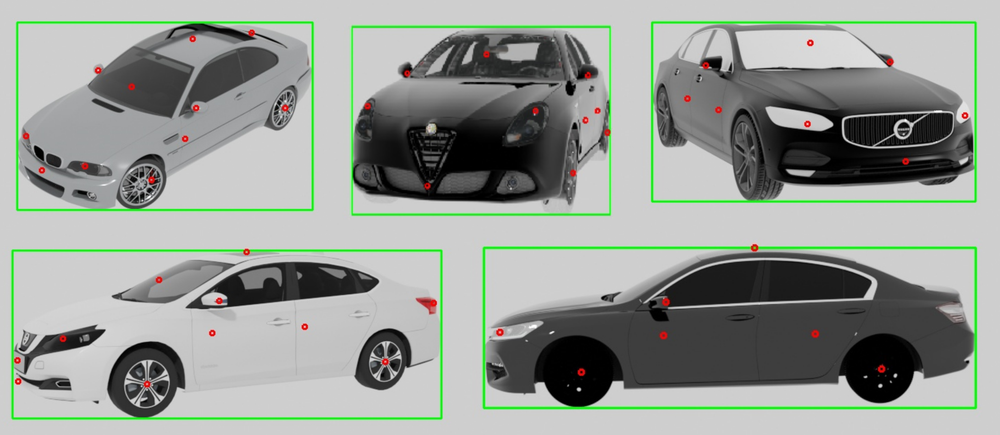

# Automotive Keypoint Detector 
<div style="text-align: justify;">
We present a novel framework for automotive keypoint detection. Our approach tackles the significant challenges posed by the variability in shapes, sizes, and appearances of vehicles. Traditional methods relying on manual annotation are both time-consuming and error-prone, while models trained on synthetic data often suffer from domain-shift when applied to real-world images. To overcome these issues, we developed a comprehensive keypoint detection system, leveraging a robust dataset of over 2000 images annotated with keypoints.
Our methodology includes the creation of a synthetic dataset using 3D models of various vehicles, automated keypoint annotation, and training of a keypoint detection model tailored to these annotations. We employ a ResNet-50 backbone with a modified Feature Pyramid Network and an enhanced keypoint head incorporating residual blocks for improved keypoint prediction accuracy. The model's performance is evaluated on both synthetic images and real-world captures, ensuring robustness and generalization to unseen data.
</div>



## Retrieval system
Furthermore, we introduce an advanced data retrieval system utilizing Object Keypoint Similarity (OKS) metrics to identify the most similar keypoints across different images, enhancing the alignment of synthetic and real image domains. This system, combined with an offline database approach for precomputed keypoint scores, significantly improves retrieval speed and accuracy.
<div align="center">
  
</div>

Dataset offline generation:
```bash
python ./src/retrieval/dataset_offline.py  --model ./src/resnet/trained_models/akd-2.3.pth --images ./src/dataset/output_test/images/clean --json ./src/retrieval/dataset.json
```

Retrieval output with a synthetic image:
```bash
python  ./src/retrieval/retrieval.py --model ./src/resnet/trained_models/akd-2.3.pth -i [image] --images ./src/dataset/output_test/images/clean --json ./src/retrieval/dataset.json
```

## Result
| **Model name** | **Description**                      | **Backbone type**    | **# Epochs** | **Keypoint Head Depth** | **Alpha** | **Dilation** | **Bbox AP** | **Bbox AR** | **Keypoint AP** | **Keypoint AR** |
|----------------|--------------------------------------|----------------------|--------------|-------------------------|-----------|--------------|-------------|-------------|----------------|----------------|
| **akd-1.0**    | Torchvision default model            | resnet50             | 8            | none                    | 1.1       | 1            | 0.900       | 0.900       | 0.600          | 0.600          |
| **akd-2.0**    | Custom KeypointHead                  | resnet50             | 8            | 10                      | 1.1       | 1            | 0.900       | 0.900       | 0.105          | 0.100          |
| **akd-2.1**    | Custom KH and changed dilation       | resnet50             | 8            | 4                       | 1.2       | 2            | 0.925       | 0.950       | 0.700          | 0.700          |
| **akd-2.2**    | Custom KH and changed dilation       | resnet50             | 11           | 2                       | 1.0       | 2            | 0.900       | 0.900       | 0.600          | 0.600          |
| **akd-2.3**    | Custom KH and changed dilation       | resnet50             | 11           | 6                       | 1.2       | 2            | **0.900**   | **0.900**   | **0.800**      | **0.800**      |
| **akd-2.4**    | Custom KH and changed dilation       | resnet50             | 15           | 6                       | 1.2       | 2            | 1.000       | 1.000       | 0.700          | 0.700          |
| **akd-3.0**    | Custom KH, custom dilation, diff BB  | resnext50\_32x4d     | 8            | 4                       | 1.2       | 2            | 0.850       | 0.900       | 0.350          | 0.400          |

## Link to our Google Drive
[ANNOTATED DATASET](https://drive.google.com/drive/folders/1GCpRsDSXSHfqCM5T36EM5d35a_DVg3LB?usp=drive_link)

HOW TO LAUNCH INFERENCE WITH LATEST MODEL:
```bash
python ./src/resnet/inference.py ./src/resnet/trained_models/akd-2.3.pth -o ./src/dataset/output_test/images/predictions/decompressed --images ./src/dataset/output_test/images/clean -c ./src/dataset/output_test/coco_annotations.json
```
